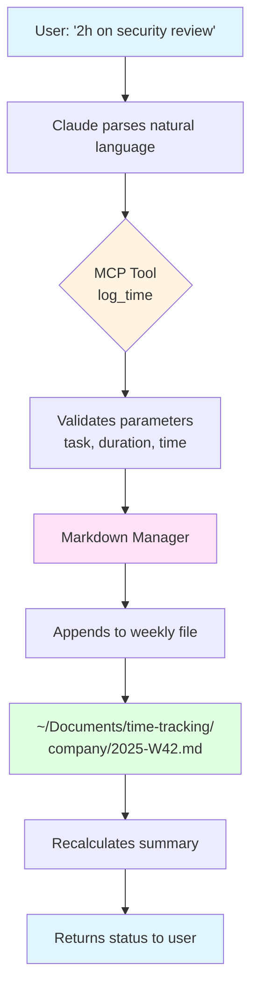
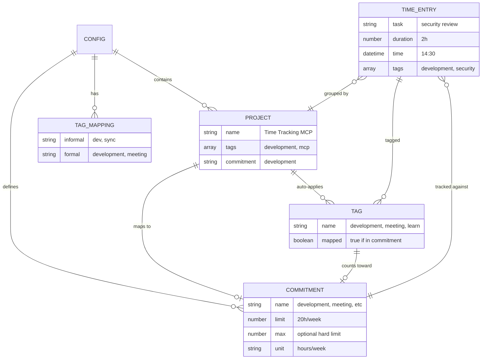

# Time Tracking MCP

Natural language time tracking for Claude Desktop using Model Context Protocol (MCP).

## Features

- **Natural Language Input** - Just say "2h on security review"
- **Markdown Storage** - Human-readable files you can edit anywhere
- **Multi-Company Support** - Track time across multiple clients/companies
- **Flexible Time Parsing** - "2h", "90 minutes", "yesterday afternoon"
- **Auto-calculated Summaries** - Weekly totals and commitment tracking
- **Smart Tagging** - Auto-categorize by #development, #meeting, #admin
- **Commitment Warnings** - Stay within your hour limits
- **Project Tracking** - Automatically group time by project
- **Automatic Formatting** - Files self-organize for readability

## Quick Start

**Platform Support:** macOS only (tested). Windows/Linux paths may differ and are untested.

### 1. Install

```bash
git clone <repo-url> time-tracking-mcp
cd time-tracking-mcp
npm install
npm run build
```

### 2. Set Up Time Tracking Directory

```bash
mkdir -p ~/Documents/time-tracking/HeliMods
mkdir -p ~/Documents/time-tracking/Stellantis
```

Create `~/Documents/time-tracking/HeliMods/config.json`:

```json
{
  "company": "HeliMods",
  "commitments": {
    "development": { "limit": 20, "unit": "hours/week" },
    "meeting": { "limit": 5, "unit": "hours/week" },
    "total": { "limit": 25, "unit": "hours/week" }
  },
  "projects": {
    "Time Tracking MCP": {
      "tags": ["mcp"],
      "commitment": "development"
    },
    "Conduit MCP": {
      "tags": ["conduit"],
      "commitment": "development"
    }
  },
  "tagMappings": {
    "dev": "development",
    "sync": "meeting"
  }
}
```

See [docs/example-config.json](docs/example-config.json) for a complete example.

### 3. Configure Claude Desktop

#### For Claude Desktop App

Edit `~/Library/Application Support/Claude/claude_desktop_config.json`:

```json
{
  "mcpServers": {
    "TimeTracking": {
      "command": "/path/to/node",
      "args": ["/path/to/time-tracking-mcp/dist/server.js"],
      "env": {
        "TIME_TRACKING_DIR": "/Users/you/Documents/time-tracking",
        "COMPANIES": "HeliMods,Stellantis",
        "COMPANY_ABBREVIATIONS": "HeliMods:HM:helimods,Stellantis:STLA:stellantis"
      }
    }
  }
}
```

**Find your paths:**
- Node: `which node`
- Project: Use full absolute path to this directory

#### For Claude Code CLI

Edit `~/.config/claude-code/settings.json`:

```json
{
  "mcpServers": {
    "TimeTracking": {
      "command": "node",
      "args": ["/path/to/time-tracking-mcp/dist/server.js"],
      "env": {
        "TIME_TRACKING_DIR": "/Users/you/Documents/time-tracking",
        "COMPANIES": "HeliMods,Stellantis",
        "COMPANY_ABBREVIATIONS": "HeliMods:HM:helimods,Stellantis:STLA:stellantis"
      }
    }
  }
}
```

### 4. Restart Claude

Close and reopen Claude Desktop or restart Claude Code CLI.

### 5. Test It

```
You: "Just spent 2 hours on Time Tracking MCP"
Claude: "Logged! Added 2h for Time Tracking MCP at 14:30.
        You're at 10.6h this week (42% of 25h limit)."
```

## Your First Day

### Quick Glossary

Before you dive in, here are the core concepts:

- **Entry**: A single time log (e.g., "2h on security review at 14:30")
- **Tag**: Category marker that categorizes work (`#development`, `#meeting`, `#admin`)
- **Commitment**: Time allocation bucket (e.g., development: 20h/week, meeting: 5h/week)
- **Project**: Collection of related work (automatically mapped via tags)
- **Company**: Separate time tracking workspace (HeliMods, Stellantis, etc.)

### Mental Model: How It Works

```
Your entry → Tag detected → Maps to Commitment → Groups into Project → Appears in Reports
```

**Example flow:**
1. You say: "2h on Conduit MCP security review"
2. System detects: `#conduit` tag (from "Conduit MCP")
3. Maps to: `development` commitment (via config.json projects)
4. Groups into: "Conduit MCP" project
5. Appears in: Weekly totals, commitment tracking, project breakdown

### 5-Minute Tutorial

**Step 1: Log your first entry**
```
You: "Just spent 2 hours on project review"
Claude: "Logged! Added 2h for project review at 14:30."
```

**Step 2: Check your hours**
```
You: "How many hours this week?"
Claude: "Week 42 Summary: 2.0h / 25h (8%)"
```

**Step 3: View your report**
```
You: "Show me this week's report"
Claude: [Shows detailed weekly breakdown by day, project, and tags]
```

### Common Workflows

**Daily logging:**
- Log as you work: "1.5h on client meeting"
- Or batch at end of day: "Today I did 3h development, 1h meeting"

**Weekly review:**
- Check totals: "How am I tracking this week?"
- Review commitments: "Show me this week's breakdown"
- Spot overages: System warns you at 90% and 100% of limits

**Monthly reporting:**
- Generate reports: "Show me week 42 report"
- Review by project: Reports show automatic project grouping
- Track trends: Compare week-over-week totals

### Next Steps

- See [Usage Examples](docs/guides/usage-examples.md) for natural language patterns
- Read [Tag System Guide](docs/architecture/tag-system.md) to understand tag routing
- Check [Multi-Company Patterns](docs/architecture/multi-company-patterns.md) for multi-client workflows

## Usage

Just talk naturally to Claude:

```
You: "Just spent 2 hours on Conduit security review"
Claude: "Logged! You're at 23.5h / 25h (94%)"

You: "How am I tracking this week?"
Claude: "Week 42 Summary:
        • Total: 23.5h / 25h (94%)
        • Development: 18.0h / 20h (90%)
        • Meetings: 5.5h / 5h (110%) ⚠️"

You: "Client meeting yesterday 90 minutes"
Claude: "Logged 1.5h for client meeting on Oct 16 ✓"

You: "Show me this week's report"
Claude: [Detailed weekly report with breakdown by day, project, and tags]
```

See [docs/guides/usage-examples.md](docs/guides/usage-examples.md) for more examples and advanced features.

## How It Works



### File Structure

```
~/Documents/time-tracking/
  HeliMods/
    config.json
    2025-W42.md
    2025-W43.md
  Stellantis/
    config.json
    2025-W42.md
```

### Week File Example

```markdown
# Time Tracking - HeliMods - Week 42 (Oct 14-20, 2025)

## Summary
- **Total:** 23.5h / 25h (94%)
- **Development:** 18.0h / 20h (90%)
- **Meetings:** 5.5h / 5h (110%) ⚠️

**By Project:**
• Time Tracking MCP: 6.4h
• Conduit MCP: 12.0h

---

## 2025-10-17 Friday (10.1h)

- 19:00 add project tracking (1.0h) #mcp
- 18:02 development (1.0h)
- 17:28 HeliMods update (1.0h)
- 22:59 client meeting (1.5h)
- 06:46 documentation (0.3h) #development
- 05:52 MCP server (1.0h) #development
```

**You can edit these files directly!**

## Configuration

### Environment Variables

| Variable | Description | Default |
|----------|-------------|---------|
| `TIME_TRACKING_DIR` | Where to store markdown files | `~/Documents/time-tracking` |
| `COMPANIES` | Comma-separated list of companies (enables multi-company mode). Omit for single-company mode. | None (single-company mode) |
| `COMPANY_ABBREVIATIONS` | Company name abbreviations for quick entry (format: `Company:abbr1:abbr2,Company2:abbr3`) | None |
| `DISPLAY_TIMEZONE_OFFSET` | Hours offset from UTC for display | `0` |
| `DISPLAY_TIMEZONE_STRING` | Timezone name for display | `UTC` |
| `FLEXIBLE_DURATION_PARSING` | Enable flexible duration parsing in markdown | `false` |

#### Timezone Examples

```json
"env": {
  "DISPLAY_TIMEZONE_OFFSET": "10",
  "DISPLAY_TIMEZONE_STRING": "AEST"
}
```

Common timezones:
- Sydney/Melbourne: `10` (AEST) or `11` (AEDT)
- London: `0` (GMT) or `1` (BST)
- New York: `-5` (EST) or `-4` (EDT)
- Los Angeles: `-8` (PST) or `-7` (PDT)

#### Flexible Duration Parsing (Experimental)

When `FLEXIBLE_DURATION_PARSING=true`, the markdown parser accepts multiple formats:

**Supported formats:**
- Standard: `(2h)`, `(2.5h)`
- Minutes: `(30m)`, `(90m)`
- Natural: `(2 hours)`, `(90 minutes)`

**How it works:**
1. Manual edits can use any format
2. On next recalculation, entries normalize to standard `(Xh)` format
3. Invalid durations are silently ignored

**Default (false):** Only strict `(Xh)` format is parsed, protecting against accidental format corruption.

### Company Configuration

Each company directory should have a `config.json`:

```json
{
  "company": "Company Name",
  "commitments": {
    "development": { "limit": 15, "unit": "hours/week" },
    "meeting": { "limit": 5, "unit": "hours/week" },
    "admin": { "limit": 3, "unit": "hours/week" },
    "total": { "limit": 23, "max": 30, "unit": "hours/week" }
  },
  "projects": {
    "Project Name": {
      "tags": ["development", "security"],
      "commitment": "development"
    }
  },
  "tagMappings": {
    "dev": "development",
    "sync": "meeting"
  }
}
```

**Configuration options:**

- **commitments**: Define hour limits per category
  - **`limit`**: Your target weekly hours for this commitment (e.g., 23h/week)
  - **`max`** (optional): Hard maximum hours for overflow tracking (e.g., 30h buffer)
    - Shows ⚠️ OVERFLOW when between `limit` and `max`
    - Shows 🚨 EXCEEDED MAX when over `max`
    - Useful for tracking occasional overages without constant warnings
  - **`unit`**: Typically "hours/week"
  - **`total`** commitment: Should equal the sum of other commitment limits (e.g., 15 + 5 + 3 = 23)

- **projects**: Group related work
  - Automatically categorized by tags
  - Maps to commitment categories

- **tagMappings**: Create shortcuts
  - Map informal tags to formal commitment names

### Understanding Commitments vs Tags

**Commitments** track against hour limits and trigger warnings:
- Defined in `config.json` with specific limits
- Example: `development: 20h/week`, `meeting: 5h/week`
- Tags mapped to commitments count against those limits
- Exceeding commitment limits shows ⚠️ warnings

**Tags** provide visibility without commitment enforcement:
- All tagged hours count toward your total weekly limit
- Only tags mapped to commitments count against specific commitment limits
- Unmapped tags (like `#learn`, `#research`, `#admin`) are tracked for visibility but don't trigger warnings
- Great for tracking activities that don't fit formal commitments

**Example:**
```
Weekly total: 25h limit
- 20h with #development tag → counts against development commitment (20h limit)
- 2h with #learn tag → counts toward total (25h), no specific commitment
- 3h with #meeting tag → counts against meeting commitment (5h limit)

Result: 25h total, development at limit, meeting under limit, #learn visible in reports
```

This lets you track all your time while only enforcing limits on specific commitment categories.

### Configuration Relationships



## Multi-Company Usage

### Prefix Pattern
```
You: "hm 2h on security review"     # HeliMods
You: "stla 1h client meeting"       # Stellantis
```

### Suffix Pattern
```
You: "2h on security review for HeliMods"
You: "1h meeting for Stellantis"
```

### Company-Specific Queries
```
You: "Status for HeliMods"
You: "Show me Stellantis report"
```

### Default Company Behavior

**When company is clear from input:** Uses the specified company (via prefix, suffix, or explicit mention)

**When company is ambiguous:** For safety, Claude will **prompt you** to clarify which company you mean rather than automatically defaulting. This prevents accidentally logging time to the wrong company.

**First company as fallback:** The first company in your `COMPANIES` list is used only when the intent is genuinely unclear and you don't specify otherwise. However, Claude is designed to ask rather than assume.

## Natural Language Examples

### Logging Time
- "2h on security review"
- "Just finished 90 minutes on client meeting"
- "Spent half an hour on email"
- "Yesterday afternoon I did 3 hours of code review"

### Checking Status
- "How many hours this week?"
- "Am I over my limit?"
- "What did I work on today?"
- "Show me this week's breakdown"

### Getting Reports
- "Show me this week's report"
- "Generate last week's report"
- "Weekly summary for Stellantis"

## Tools Available

Claude automatically uses these MCP tools when you interact naturally:

- **log_time** - Log a completed task
- **status** - Quick weekly status check
- **check_hours** - Detailed breakdown (today/week/month)
- **weekly_report** - Generate formatted report

You never call these directly - just talk to Claude naturally!

## Development

See [docs/guides/development.md](docs/guides/development.md) for developer documentation.

```bash
npm run build        # Compile TypeScript
npm run dev          # Development mode (auto-reload)
npm run rebuild      # Clean build
npm run release      # Create new version
```

## Why MCP?

Traditional time tracking tools require context switching and structured input. With MCP:

1. **Stay in Claude** - No app switching
2. **Natural language** - No forms or timers
3. **Voice-friendly** - Mac dictation works perfectly
4. **Portable data** - Plain markdown files
5. **AI-enhanced** - Claude understands your intent

## Troubleshooting

### Claude doesn't respond to time tracking

1. Check Claude config has correct paths (use absolute paths, not `~`)
2. Verify `npm run build` completed successfully
3. Restart Claude completely
4. Check logs: `~/Library/Logs/Claude/mcp*.log`

### "No module found" errors

```bash
npm run rebuild
```

### Wrong timezone

Update `DISPLAY_TIMEZONE_OFFSET` in your Claude config.

### Files not being created

- Ensure `TIME_TRACKING_DIR` exists and is writable
- Use full absolute paths in configuration
- Check file permissions

### Changes not taking effect after rebuild

If you've modified and rebuilt the MCP server (`npm run build`) but Claude still exhibits old behavior:

1. **Restart Claude completely**
   - **Claude Desktop**: Quit the app (Cmd+Q), then relaunch
   - **Claude Code CLI**: Exit the session (Ctrl+C), then run `claude` again

2. **Why this happens**: MCP servers run as separate processes. When you rebuild, the compiled JavaScript in `dist/` updates, but Claude is still running the old cached version until you restart.

3. **After restart**: Changes will take effect immediately. You can verify by checking that new behavior works as expected.

## Versioning

This project uses [commit-and-tag-version](https://github.com/absolute-version/commit-and-tag-version) for semantic versioning.

**Commit message format:**
```
feat: add support for monthly reports
fix: correct duration parsing for fractional hours
perf: optimize summary calculations
```

## See Also

- [Usage Examples](docs/guides/usage-examples.md) - Natural language patterns and multi-company workflows
- [Tag System Guide](docs/architecture/tag-system.md) - Deep dive into tag-based architecture
- [Multi-Company Patterns](docs/architecture/multi-company-patterns.md) - Pattern 1 vs Pattern 2 comparison
- [Development Guide](docs/guides/development.md) - Contributing and development workflow
- [Full Documentation Index](docs/README.md) - Complete documentation map

## Design Philosophy

### Rounding as a Feature

Time entries are displayed with 1 decimal place precision (e.g., `0.5h`, `2.3h`). This creates a natural minimum of **3 minutes** - anything less displays as `0h`.

This isn't a limitation - it's a feature that models reality:

**The context-switching tax:**
```
10 × 3-minute tasks = 30 minutes actual work
                    = 1.0h displayed (10 × 0.1h)
                    = 0.5h overhead accounted for
```

**Why this matters:**

Ten 3-minute interruptions genuinely consume closer to an hour of your productive capacity than just 30 minutes. Each task switch incurs hidden costs:
- Mental context switching between tasks
- Time to regain flow state after interruptions
- Finding where you left off and reloading mental state
- Decision fatigue from rapid context changes

The rounding isn't imprecise - it's **more truthful** than precise tracking would be. It automatically accounts for the real cognitive overhead of fragmented work.

### Automatic Formatting

Time tracking files self-organize on every write:
- Consistent spacing between sections
- No manual formatting maintenance required
- User notes preserved and clearly separated
- Files stay readable in git diffs

The system enforces 8 spacing rules automatically (see [Format Specification](docs/reference/format-specification.md)) while preserving all your content. Manual edits won't break formatting - the next time entry will clean things up.

### Auto-Healing Data

Summaries and totals are **calculated, never stored**:
- Manual edits can't corrupt totals
- Files always show accurate state
- No "sync" or "rebuild" commands needed
- Trust the recalculation

This design means you can freely edit markdown files by hand and the system will reconcile everything automatically.

## License

MIT

## Author

Mark Wharton
