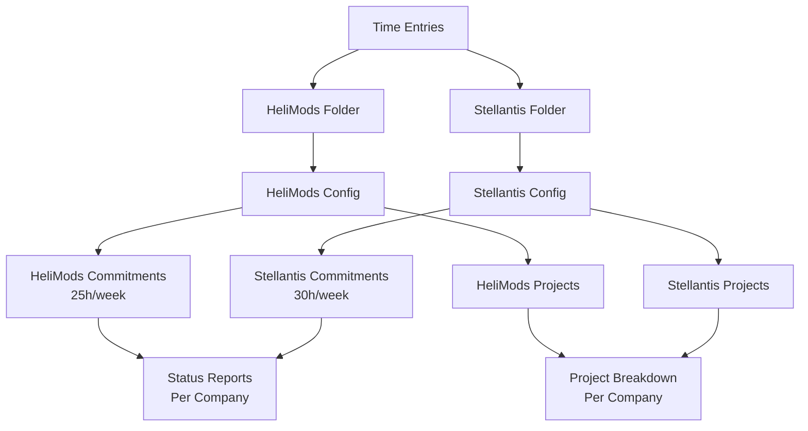
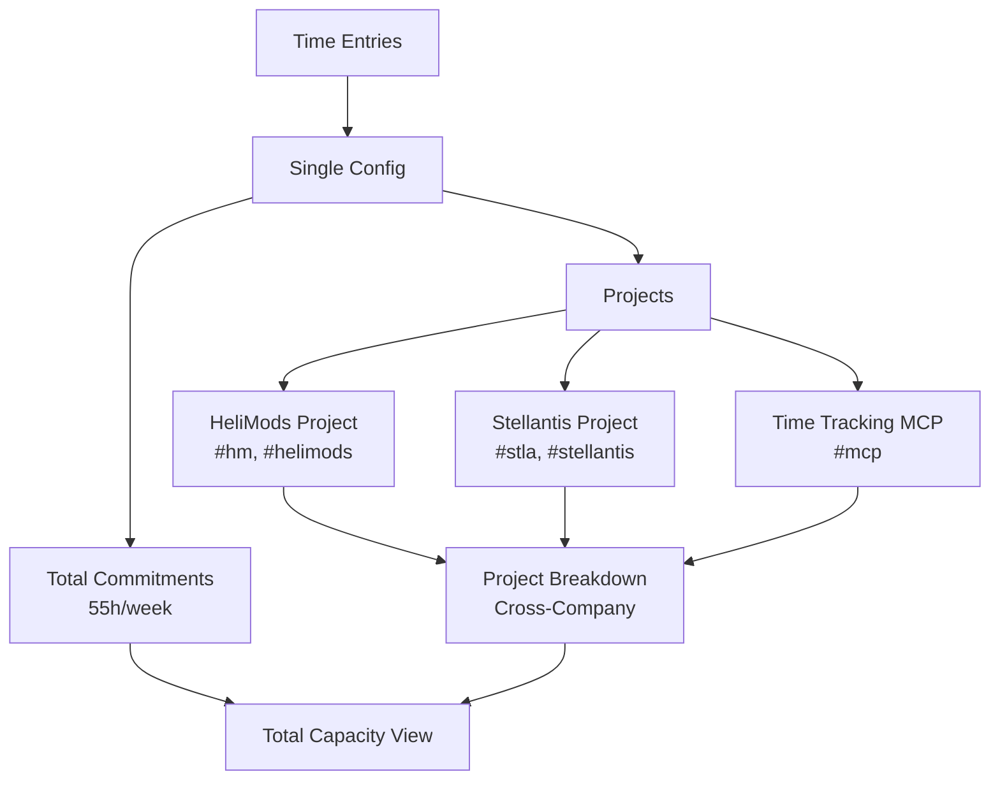
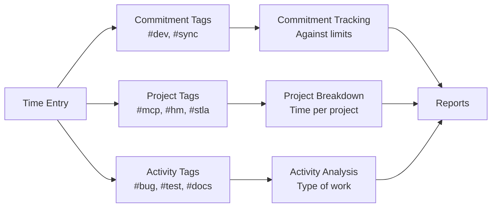

# Multi-Company Configuration Patterns

## Overview

The time tracking system's flexible tag-based architecture naturally supports multiple organizational patterns without requiring code changes. You can choose the pattern that best fits your needs, or even transition between patterns as your situation evolves.

## Two Complementary Approaches

The system supports two distinct patterns for managing work across multiple companies, each with different tradeoffs.

### Pattern 1: Separate Company Configs (Isolated Tracking)

**Use when:** You want strict separation between companies, per-company commitment limits, and independent tracking.



**Directory Structure:**
```
~/Documents/time-tracking/
├── HeliMods/
│   ├── config.json
│   └── 2025-W42.md
└── Stellantis/
    ├── config.json
    └── 2025-W42.md
```

**HeliMods config.json:**
```json
{
  "company": "HeliMods",
  "commitments": {
    "development": { "limit": 20, "unit": "hours/week" },
    "meeting": { "limit": 5, "unit": "hours/week" },
    "total": { "limit": 25, "max": 30, "unit": "hours/week" }
  },
  "projects": {
    "Time Tracking MCP": {
      "tags": ["mcp"],
      "commitment": "development"
    },
    "HeliMods Internal": {
      "tags": ["internal", "helimods"],
      "commitment": "development"
    }
  },
  "tagMappings": {
    "dev": "development",
    "sync": "meeting"
  }
}
```

**Stellantis config.json:**
```json
{
  "company": "Stellantis",
  "commitments": {
    "development": { "limit": 25, "unit": "hours/week" },
    "meeting": { "limit": 5, "unit": "hours/week" },
    "total": { "limit": 30, "max": 35, "unit": "hours/week" }
  },
  "projects": {
    "S2IRIUS Integration": {
      "tags": ["s2irius", "stellantis"],
      "commitment": "development"
    },
    "DVPM Tools": {
      "tags": ["dvpm"],
      "commitment": "development"
    }
  },
  "tagMappings": {
    "dev": "development",
    "sync": "meeting"
  }
}
```

**Usage:**
```markdown
# HeliMods/2025-W42.md
## 2025-10-18 Saturday

- 10:00 MCP bug fixes (2h) #dev #mcp
- 14:00 HeliMods sync (1h) #sync #internal
```

```markdown
# Stellantis/2025-W42.md
## 2025-10-18 Saturday

- 11:00 S2IRIUS API integration (3h) #dev #s2irius
- 15:00 DVPM meeting (1h) #sync #dvpm
```

**Status Reports:**
```bash
# Check HeliMods status
mcp status --company=HeliMods
# Output: 23h / 25h (92%)

# Check Stellantis status
mcp status --company=Stellantis
# Output: 28h / 30h (93%)
```

**Advantages:**
- ✅ Strict per-company commitment tracking
- ✅ Clear separation of business relationships
- ✅ Independent configuration and limits
- ✅ Easy to share one company's data without exposing others
- ✅ Scales well (add new companies by adding folders)

**Disadvantages:**
- ❌ Config duplication (tag mappings in both files)
- ❌ Shared projects need to be defined in multiple places
- ❌ No built-in cross-company aggregation
- ❌ Need to specify company when running commands

### Pattern 2: Single Config with Project-Based Allocation (Unified Tracking)

**Use when:** You want to track total personal capacity flexibly distributed across clients, with cross-functional project visibility.



**Directory Structure:**
```
~/Documents/time-tracking/
├── config.json
└── 2025-W42.md
```

**Or with organizational folders (folders are just for organization):**
```
~/Documents/time-tracking/
├── config.json
├── HeliMods/
│   └── 2025-W42.md
└── Stellantis/
    └── 2025-W42.md
```

**Single config.json:**
```json
{
  "company": "Mark Wharton",
  "commitments": {
    "development": { "limit": 45, "unit": "hours/week" },
    "meeting": { "limit": 10, "unit": "hours/week" },
    "total": { "limit": 55, "max": 65, "unit": "hours/week" }
  },
  "projects": {
    "HeliMods": {
      "tags": ["hm", "helimods"],
      "commitment": "development",
      "description": "HeliMods client work"
    },
    "Stellantis": {
      "tags": ["stla", "stellantis"],
      "commitment": "development",
      "description": "Stellantis client work"
    },
    "Time Tracking MCP": {
      "tags": ["mcp"],
      "commitment": "development",
      "description": "MCP server development (cross-client)"
    },
    "S2IRIUS Integration": {
      "tags": ["s2irius"],
      "commitment": "development",
      "description": "Stellantis S2IRIUS work"
    }
  },
  "tagMappings": {
    "dev": "development",
    "sync": "meeting"
  }
}
```

**Usage (cross-functional tagging):**
```markdown
## 2025-10-18 Saturday

- 10:00 MCP bug fixes for HeliMods (2h) #dev #mcp #hm
- 11:00 MCP integration for Stellantis (3h) #dev #mcp #stla
- 14:00 HeliMods sync (1h) #sync #hm
- 15:00 S2IRIUS API work (2h) #dev #s2irius #stla
```

**Status Report (unified view):**
```
📊 Week 42 Status

Total: 51h / 55h (93%)
Development: 43h / 45h (96%)
Meeting: 8h / 10h (80%)

By Project:
• HeliMods: 23h
• Stellantis: 28h
• Time Tracking MCP: 5h (2h HeliMods + 3h Stellantis)
• S2IRIUS Integration: 15h
```

**Advantages:**
- ✅ Single config to maintain
- ✅ Natural cross-functional tagging (#mcp works across clients)
- ✅ Project breakdown shows client distribution automatically
- ✅ See total utilization across all work
- ✅ Shared projects defined once
- ✅ No company selection needed

**Disadvantages:**
- ❌ Cannot enforce per-company contractual limits
- ❌ No strict separation between business relationships
- ❌ All companies share the same commitment pool

## Comparison Matrix

| Feature | Separate Configs | Single Config |
|---------|-----------------|---------------|
| **Per-company limits** | ✅ Yes | ❌ No (total capacity only) |
| **Cross-company projects** | ❌ Need duplication | ✅ Natural |
| **Config maintenance** | ❌ Multiple files | ✅ Single file |
| **Business separation** | ✅ Clear boundaries | ❌ Mixed |
| **Scalability (3-4 companies)** | ✅ Clean addition | ✅ Clean addition |
| **Total capacity view** | ❌ Manual aggregation | ✅ Built-in |
| **Data isolation** | ✅ Easy to share/archive | ❌ All or nothing |
| **Company selection** | ❌ Required | ✅ Not needed |

## Hybrid Approach: Best of Both Worlds

You can even combine both patterns for maximum flexibility:

**Setup:**
- Use **separate configs** for primary tracking (per-company limits)
- Occasionally create a **unified view** for cross-company analysis

**How:**
1. Maintain separate company configs (Pattern 1)
2. When you want cross-company insights, temporarily merge to single config (Pattern 2)
3. Or build aggregation tooling that combines separate configs

## Choosing the Right Pattern

### Choose Pattern 1 (Separate Configs) if:
- ✅ You have contractual per-company hour limits
- ✅ You need strict business separation
- ✅ Per-company tracking is your primary need
- ✅ You may share one company's data independently

### Choose Pattern 2 (Single Config) if:
- ✅ You track total personal capacity, flexibly distributed
- ✅ Cross-functional project tracking is important
- ✅ You want simplified configuration
- ✅ You don't need per-company limit enforcement

### You can transition between patterns:
- Start with Pattern 2 (simple, single config)
- Migrate to Pattern 1 if you need per-company limits later
- Or vice versa - the markdown files don't change!

## Cross-Functional Tagging

Both patterns support multi-dimensional tagging:



**Example entry showing all three layers:**
```markdown
- 10:00 Fixed MCP parser bug (2h) #dev #mcp #hm #bug #test
```

**Breaks down as:**
- **Commitment**: Development (via #dev)
- **Projects**: Time Tracking MCP + HeliMods (via #mcp + #hm)
- **Activity**: Bug fix with testing (via #bug + #test)

This gives you multiple analytical views of the same 2 hours:
- Counted once toward development commitment
- Counted in both "Time Tracking MCP" and "HeliMods" projects
- Counted in both #bug and #test activity tags

## Implementation Note

**Both patterns work with the existing codebase** - no code changes required! The architecture naturally supports both through:

1. **Folder-based company routing** - Where you write the entry determines the company context
2. **Tag-based project matching** - Tags determine which projects get credit
3. **Flexible commitment tracking** - Commitments can be per-company or total capacity

This is emergent design at its best - the system's flexibility comes from clean separation of concerns, not from anticipating every use case.

## Migration Examples

### From Separate Configs to Single Config

**Before:**
```
HeliMods/config.json + Stellantis/config.json
```

**After:**
1. Merge commitments (sum the limits)
2. Add company projects with unique tags
3. Combine tag mappings
4. Move markdown files to single folder (optional)

### From Single Config to Separate Configs

**Before:**
```
config.json (total capacity)
```

**After:**
1. Split commitments per company
2. Duplicate shared tag mappings
3. Define company-specific projects
4. Organize markdown files into folders

## See Also

- [TAG_SYSTEM.md](TAG_SYSTEM.md) - Tag system design and architecture
- [FORMAT_SPEC.md](../FORMAT_SPEC.md) - Markdown file format
- [README.md](../README.md) - Getting started guide
