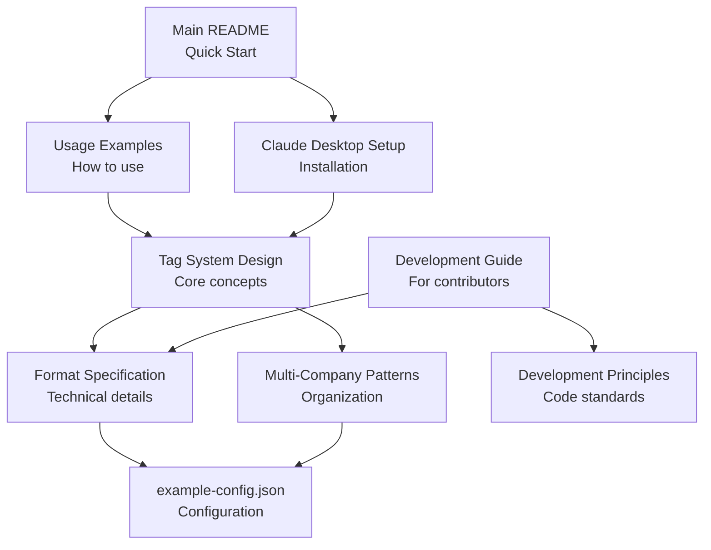

# Time Tracking MCP - Documentation Index

Complete documentation for the Time Tracking MCP server.

## Getting Started

**New users start here:**
1. [Main README](../README.md) - Quick start and overview
2. [Usage Examples](guides/usage-examples.md) - Natural language examples
3. [Claude Desktop Setup](setup/claude-desktop.md) - Configure your MCP server

## Architecture Documentation

Deep dives into system design and implementation:

### [Tag System Design](architecture/tag-system.md)
Understanding the flexible tag-based architecture that powers time tracking.

**Topics covered:**
- Architecture flow: Tags → Mappings → Projects → Commitments
- Three-layer tagging strategy (commitment, project, activity)
- Tag mappings for shortcuts (#dev → #development)
- Projects as bridges linking tags to commitments
- Common patterns and troubleshooting
- Design principles and benefits

**When to read:** Essential for understanding how tags, projects, and commitments work together.

### [Multi-Company Patterns](architecture/multi-company-patterns.md)
Two organizational approaches for managing work across multiple companies.

**Topics covered:**
- Pattern 1: Separate configs with per-company limits
- Pattern 2: Single config with project-based allocation
- Comparison matrix and when to use each
- Migration paths between patterns
- Environment configuration

**When to read:** When setting up time tracking for multiple companies or clients.

### [Development Principles](architecture/development-principles.md)
Core principles for developers working on this codebase.

**Topics covered:**
- 8 core development principles
- DRY principle with practical examples
- Code organization standards
- Markdown formatting guidelines
- Refactoring checklists

**When to read:** Before making any code changes to this project.

## Reference Documentation

Technical specifications and schemas:

### [Format Specification](reference/format-specification.md)
Complete markdown file format specification.

**Topics covered:**
- File structure and naming (ISO 8601 week format)
- Format version markers
- Entry line format and regex patterns
- Tag system implementation
- Summary calculation
- Flexible vs strict parsing modes

**When to read:** When working with markdown file parsing or format changes.

### [Validation Rules](reference/validation-rules.md)
Comprehensive input validation rules for data integrity and security.

**Topics covered:**
- Duration validation (min: 5min, max: 24h)
- Task description sanitization (markdown injection prevention)
- Date/time parsing rules and formats
- Company name security (path traversal prevention)
- Week number validation (ISO weeks, 52-53 per year)
- Configuration validation (JSON syntax)
- Error messages and examples
- Testing coverage

**When to read:** When you encounter validation errors, need to understand input constraints, or are implementing features that handle user input.

### [Configuration Schema](example-config.json)
Example company configuration file with all available options.

**Topics covered:**
- Company metadata
- Commitment limits (with overflow tracking)
- Project definitions with unique identifier tags
- Tag mappings for shortcuts

**When to read:** When setting up a new company config or understanding available options.

## Development Guides

For contributors and developers:

### [Development Guide](guides/development.md)
Quick guide for developers working on Time Tracking MCP.

**Topics covered:**
- Project structure and file organization
- Architecture diagrams (tools → services → utils)
- Development workflow
- Testing and building
- MCP protocol integration

**When to read:** Before contributing code to this project.

### [Usage Examples](guides/usage-examples.md)
Natural language examples for using Time Tracking MCP with Claude.

**Topics covered:**
- Basic time logging
- Using tags and projects
- Retroactive entries
- Time queries and status checks
- Weekly reports

**When to read:** When learning how to use the time tracking system.

## Setup Guides

Configuration and installation:

### [Claude Desktop Setup](setup/claude-desktop.md)
MCP server configuration for Claude Desktop and Claude Code CLI.

**Topics covered:**
- Claude Desktop vs Claude Code CLI differences
- Configuration file locations
- Environment variables
- Troubleshooting MCP server issues

**When to read:** During initial setup or when configuring environment variables.

## Document Relationships

## How to Navigate

### For Users
1. Start with [Main README](../README.md)
2. Follow [Usage Examples](guides/usage-examples.md)
3. Read [Tag System Design](architecture/tag-system.md) to understand tags and projects
4. Check [Multi-Company Patterns](architecture/multi-company-patterns.md) if working with multiple companies

### For Developers
1. Read [Development Principles](architecture/development-principles.md)
2. Review [Development Guide](guides/development.md) for project structure
3. Study [Tag System Design](architecture/tag-system.md) for core architecture
4. Reference [Format Specification](reference/format-specification.md) when working with files

### For Troubleshooting
1. Check [Usage Examples](guides/usage-examples.md) for correct patterns
2. Review [Tag System Design - Troubleshooting](architecture/tag-system.md#troubleshooting)
3. Verify config against [example-config.json](example-config.json)
4. Check [Format Specification](reference/format-specification.md) for entry format

## Contributing to Documentation

When adding new documentation:
- Place guides in `guides/`
- Place architecture docs in `architecture/`
- Place reference docs in `reference/`
- Place setup docs in `setup/`
- Use kebab-case for filenames
- Add entry to this index
- Update CLAUDE.md if relevant for Claude Code

## Quick Reference

| Topic | Document | Section |
|-------|----------|---------|
| Natural language logging | [Usage Examples](guides/usage-examples.md) | Basic Logging |
| Tag strategy | [Tag System Design](architecture/tag-system.md) | Three-Layer Tagging |
| Project configuration | [Tag System Design](architecture/tag-system.md) | Project Matching |
| Multi-company setup | [Multi-Company Patterns](architecture/multi-company-patterns.md) | Pattern 1 vs 2 |
| Entry format | [Format Specification](reference/format-specification.md) | Entry Line Format |
| Input validation | [Validation Rules](reference/validation-rules.md) | All Rules |
| Error messages | [Validation Rules](reference/validation-rules.md) | Error Messages |
| Environment variables | [Claude Desktop Setup](setup/claude-desktop.md) | Environment Configuration |
| Development workflow | [Development Guide](guides/development.md) | Project Structure |
| Code principles | [Development Principles](architecture/development-principles.md) | Core Principles |

## See Also

- [Main README](../README.md) - Quick start and overview
- [Tag System Guide](architecture/tag-system.md) - Core architecture concept
- [Usage Examples](guides/usage-examples.md) - Practical examples for getting started
