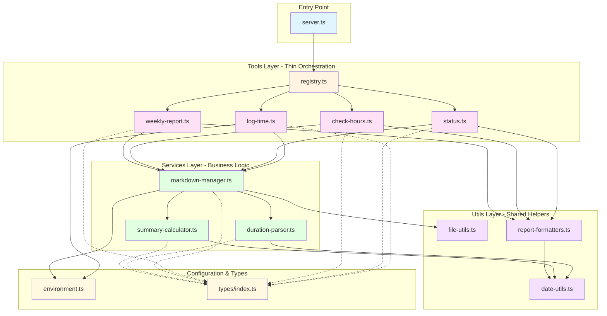
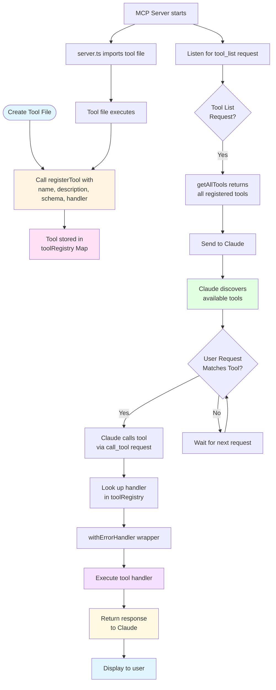
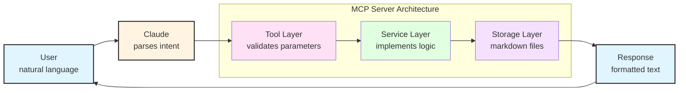

# Development Guide

Quick guide for developers working on Time Tracking MCP.

## Quick Setup

```bash
git clone <repo-url> time-tracking-mcp
cd time-tracking-mcp
npm install
npm run build
```

## Project Structure

```
src/
├── server.ts              # MCP server entry point
├── config/
│   └── environment.ts     # Environment variable handling
├── tools/                 # MCP tool implementations (thin orchestration layer)
│   ├── registry.ts        # Tool registration system
│   ├── log-time.ts
│   ├── status.ts
│   ├── check-hours.ts
│   └── weekly-report.ts
├── services/              # Business logic (heavy lifting)
│   ├── markdown-manager.ts
│   ├── duration-parser.ts
│   └── summary-calculator.ts
├── utils/                 # Shared utilities
│   ├── date-utils.ts
│   ├── file-utils.ts
│   └── report-formatters.ts
└── types/
    └── index.ts           # TypeScript interfaces
```

### Architecture Diagram



## Key Design Decisions

### Markdown Storage
Store time entries in human-readable markdown files instead of a database. This provides:
- Human-readable and editable files
- Git-friendly version control
- Zero database setup or corruption risks
- Future-proof format

### Direct Entry Model
Log completed tasks directly instead of start/stop tracking:
- Simpler mental model
- Works retroactively ("yesterday I spent 2h...")
- No "forgot to stop timer" problems

### Auto-Calculated Summaries
Calculate summaries on-the-fly from entries rather than storing them:
- Always accurate
- Manual edits automatically reflected
- Single source of truth

### Stateless Server
MCP server has no memory between calls:
- Each request is independent
- Markdown files are the source of truth
- No caching complexity

## Development Commands

```bash
npm run dev        # Auto-reload development mode
npm run build      # Compile TypeScript
npm run rebuild    # Clean + build
```

## Adding a New Tool

1. **Create tool file** in `src/tools/`:

```typescript
import { registerTool } from './registry.js';
import { createTextResponse, withErrorHandler } from '../utils/tool-response.js';

registerTool({
    name: 'my_new_tool',
    description: `Description that helps Claude understand when to use this.

    Natural language examples:
    - "Example user query"
    - "Another example"`,
    inputSchema: {
        type: 'object',
        properties: {
            param1: {
                type: 'string',
                description: 'Parameter description'
            }
        },
        required: ['param1']
    },
    handler: withErrorHandler('doing my task', async (args) => {
        // Implementation
        return createTextResponse('Result');
    })
});
```

2. **Import in server.ts**:

```typescript
import './tools/my-new-tool.js';
```

3. **Rebuild and test** in Claude Desktop

### Tool Registration Lifecycle



## Code Organization Principles

### Layer Responsibilities
- **Tools** - Validate input, call services, format output
- **Services** - Business logic, file operations
- **Utils** - Reusable helpers
- **Types** - Shared interfaces

### DRY Principle
See [CLAUDE.md](CLAUDE.md) for detailed guidance on avoiding code duplication.

**Key rule:** If logic appears in multiple places, extract to a shared utility.

### Error Handling
Always use `withErrorHandler` wrapper:

```typescript
handler: withErrorHandler('context', async (args) => {
    // Your code - errors are caught automatically
})
```

## Testing

### Manual Testing
1. Build: `npm run build`
2. Update Claude Desktop config
3. Restart Claude Desktop
4. Test with natural language queries

### Debugging
Check Claude logs:
```bash
tail -f ~/Library/Logs/Claude/mcp*.log
```

## Commit Conventions

Use [Conventional Commits](https://www.conventionalcommits.org/):

```bash
feat: add monthly report tool
fix: correct duration parsing for fractional hours
perf: optimize summary calculations
refactor: extract date parsing utilities
docs: update usage examples
```

## Releasing

```bash
npm run release        # Patch version (0.1.0 → 0.1.1)
npm run release:minor  # Minor version (0.1.0 → 0.2.0)
npm run release:major  # Major version (0.1.0 → 1.0.0)
npm run release:dry    # Preview without committing
```

This automatically:
1. Bumps version in package.json
2. Updates CHANGELOG.md
3. Creates git commit and tag

## Data Flow



## Common Tasks

### Adding a New Duration Format
Update `parseDuration` in `src/services/duration-parser.ts`

### Changing Markdown Format
⚠️ **Breaking change** - requires migration script and major version bump

### Adding Configuration Options
1. Add to environment.ts
2. Update README.md configuration section
3. Update docs/example-config.json if needed

## Performance Notes

- Week files typically < 10KB (50 entries)
- Read time: < 1ms
- Summary calculation: O(n) where n = entries, typically < 1ms
- No optimization needed for expected workload

## File Structure

Each company has its own directory:
```
~/Documents/time-tracking/
  company-name/
    config.json          # Company configuration
    2025-W42.md          # Time entries
    2025-W43.md
```

## Philosophy

**Keep it simple.**

- Do one thing well (time tracking)
- Minimal dependencies
- Easy to understand
- Prioritize user workflow
- Remain hackable

When in doubt, choose simplicity over features.

## See Also

- [Development Principles](../architecture/development-principles.md) - Code standards and principles
- [Tag System Guide](../architecture/tag-system.md) - Core architecture understanding
- [Format Specification](../reference/format-specification.md) - Technical file format details
