# Usage Examples

Natural language examples for using Time Tracking MCP with Claude.

## Quick Start

Just talk to Claude naturally about your time:

```
You: "Just spent 2 hours on Conduit security review"

Claude: "Logged 2h for Conduit security review at 17:45

        Week 42 Status:
        • Total: 23.5h / 25h (94%)
        • Development: 18.0h / 20h (90%)
        • Meetings: 5.5h / 5h (110%) ⚠️"
```

## Logging Time

### Basic Logging

```
You: "2h on security review"
You: "Just finished 90 minutes on client meeting"
You: "Spent half an hour on email"
You: "1.5 hours on code review"
```

### With Tags

```
You: "2h on Conduit MCP security review #development #security"
You: "Client standup 30 minutes #meeting"
You: "Documentation work 1h #development"
```

### With Projects

When you have projects configured, Claude automatically groups your time:

```
You: "2h on Time Tracking MCP"
# Automatically tagged with #development #mcp #typescript
# Grouped under "Time Tracking MCP" project

You: "1h on Conduit security review"
# Automatically tagged with #development #security
# Grouped under "Conduit MCP" project
```

### Retroactive Entries

```
You: "Yesterday afternoon I did 3 hours of code review"
You: "This morning 2h on planning"
You: "2 hours ago started working on that bug fix"
You: "Last Monday I spent 4h on the integration"
```

## Multi-Company Usage

### Single Company Mode (default)
When you only have one company configured, just log time normally:
```
You: "2h on security review"
Claude: "Logged to HeliMods..."
```

### Multi-Company Mode

#### Prefix Pattern (Recommended)
Use company name or abbreviation before the time:

```
You: "hm 2h on security review"        # HeliMods
You: "HeliMods 1h client meeting"      # HeliMods
You: "stla 3h development"             # Stellantis
You: "Stellantis 2h code review"       # Stellantis
```

#### Suffix Pattern
Specify company at the end with "for":

```
You: "2h on security review for HeliMods"
You: "1h meeting for Stellantis"
You: "Client call 90 minutes for HM"
```

#### Company-Specific Queries
```
You: "Status for HeliMods"
You: "How many hours for Stellantis this week?"
You: "Show me HeliMods report"
You: "Generate Stellantis weekly report"
```

## Checking Status

### Quick Status

```
You: "How am I doing this week?"
You: "Status check"
You: "Am I over my hours?"
You: "How many hours so far?"
```

**Response:**
```
📊 Week 42 Status

Total: 23.5h / 25h (94%) ✓
Remaining: 1.5h available

By Commitment:
• Development: 18.0h / 20h (90%) ✓
• Meetings: 5.5h / 5h (110%) 🚫
```

### Today's Hours

```
You: "What did I work on today?"
You: "How many hours today?"
You: "Show me today's entries"
```

**Response:**
```
📅 Friday, 2025-10-17

Total: 10.1h

Entries:
• 19:00 add project tracking (1.0h) #mcp
• 18:02 development (1.0h)
• 22:59 client meeting (1.5h)
• 06:46 documentation (0.3h) #development
```

### Weekly Breakdown

```
You: "Show me this week's breakdown"
You: "How are my hours distributed this week?"
You: "Weekly summary"
```

**Response:**
```
📊 Week 42 Summary

Total: 10.6h / 25h (42%)

By Commitment:
• Development: 6.4h / 20h (32%)

By Project:
• Time Tracking MCP: 6.4h

By Tag:
• #development: 5.3h
• #mcp: 1.0h
• #typescript: 0.1h

By Day:
• Saturday 2025-10-18: 0.5h (1 entries)
• Friday 2025-10-17: 10.1h (12 entries)
```

## Full Reports

### This Week

```
You: "Generate this week's report"
You: "Show me the full weekly report"
You: "I need a report for this week"
```

### Last Week

```
You: "Last week's report"
You: "Generate report for last week"
```

### Specific Week

```
You: "Report for week 40"
You: "Show me week 2025-W42"
```

### Multi-Company Reports

```
You: "Generate this week's report for HeliMods"
You: "Last week's Stellantis report"
```

## Natural Language Patterns

Claude understands various ways of expressing the same thing:

### Duration Formats

- **Hours:** "2h", "2 hours", "2.5h", "two hours"
- **Minutes:** "90m", "90 minutes", "ninety minutes"
- **Mixed:** "2 hours 30 minutes", "2h30m"
- **Casual:** "half an hour", "quarter hour"
- **Plain numbers:** "2" (defaults to hours: "2h")
- **ISO 8601:** "PT2H30M" (2 hours 30 minutes)

### Time References

- **Absolute:** "at 14:30", "at 2pm", "at 2:30"
- **Relative:** "2 hours ago", "this morning", "yesterday afternoon"
- **Time of day:** "morning" (9am), "afternoon" (2pm), "evening" (6pm)
- **Implied:** "just finished" (means now)

### Date References

- **Specific:** "2025-10-17", "October 17"
- **Relative:** "today", "yesterday", "tomorrow", "last Monday"
- **Implied:** If no date mentioned, defaults to today

## Tips for Best Results

### Be Specific with Project Names

✅ Good: "2h on Conduit MCP security review"  
❌ Vague: "2h on that thing"

### Use Consistent Tags

Stick to a set of tags for better tracking:
- `#development`, `#meeting`, `#admin`, `#review`, `#security`

### Check Status Regularly

Ask Claude for status throughout the week to stay on track:
```
You: "Quick status"
Claude: "You're at 23.5h / 25h (94%). You have 1.5h remaining this week."
```

### Combine Related Work

Instead of:
- "30m on email"
- "15m on email"
- "20m on email"

Do:
- "1h on email and admin" (log once at end of day)

### Use Natural Language

Don't try to match a specific format. Just tell Claude what you did:

✅ "Just wrapped up a 2 hour meeting with the client about Q4 planning"  
✅ "Been working on security review for about 90 minutes"  
✅ "Yesterday I spent the afternoon (about 3 hours) on code review"

## Warning System

Claude will warn you when approaching or exceeding limits:

```
You: "2h on meeting"

Claude: "✓ Logged 2h for meeting at 14:00

        Week 42 Status:
        • Total: 24.5h / 25h (98%) ⚠️ Almost at limit
        • Meetings: 5.5h / 5h (110%) 🚫 OVER LIMIT

        You're at 98% of your weekly limit!"
```

## Editing Entries

If you need to edit an entry:

1. **Manual edit:** Open the markdown file and edit directly
2. **Replace entry:** Log the correct time, then manually remove the old entry
3. **Delete entry:** Open the markdown file and delete the line

Files are located at: `~/Documents/time-tracking/{company}/2025-W{N}.md`

### Flexible Duration Parsing

If you enable `FLEXIBLE_DURATION_PARSING=true` in your configuration, you can manually edit markdown files with more natural formats:

**You can use:**
- `(30m)` or `(30 minutes)`
- `(2h)` or `(2 hours)`
- `(90m)` or `(1.5h)`

**On next calculation, they normalize to:**
- `(0.5h)`
- `(2h)`
- `(1.5h)`

This makes manual editing easier while keeping files consistent.

## Example Workflow

A typical day's interaction:

```
Morning (9:15 AM):
You: "Started day with email and admin, about 45 minutes"
Claude: "✓ Logged 0.75h for email and admin..."

Midday (12:30 PM):
You: "Just finished 2.5 hours on Conduit security review"
Claude: "✓ Logged 2.5h for Conduit security review..."

Afternoon (3:00 PM):
You: "Quick status"
Claude: "You're at 8.5h / 25h (34%) this week..."

End of Day (5:45 PM):
You: "Last thing was a client meeting, 1 hour 45 minutes"
Claude: "✓ Logged 1.75h for client meeting..."

You: "What's my total today?"
Claude: "Friday Oct 17: 5.0h (3 entries)"
```

## Multi-Company Workflow Example

Working across two companies in one day:

```
Morning (9:00 AM):
You: "hm 2h on Time Tracking MCP development"
Claude: "✓ Logged to HeliMods: 2h for Time Tracking MCP..."

Afternoon (2:00 PM):
You: "stla 3h on integration testing"
Claude: "✓ Logged to Stellantis: 3h for integration testing..."

Evening (5:00 PM):
You: "Status for HeliMods"
Claude: "HeliMods Week 42: 10.6h / 25h (42%)"

You: "Status for Stellantis"
Claude: "Stellantis Week 42: 28.8h / 25h (115%) 🚫 OVER"
```

### Multi-Company Interaction Flow

```mermaid
sequenceDiagram
    participant U as User
    participant C as Claude
    participant HM as HeliMods<br/>Storage
    participant ST as Stellantis<br/>Storage

    Note over U,ST: Morning Session
    U->>C: "hm 2h on Time Tracking MCP"
    C->>C: Parse: company=HeliMods, task, duration
    C->>HM: Append time entry
    HM-->>C: Updated summary
    C->>U: "✓ Logged to HeliMods: 10.6h / 25h"

    Note over U,ST: Afternoon Session
    U->>C: "stla 3h on integration testing"
    C->>C: Parse: company=Stellantis, task, duration
    C->>ST: Append time entry
    ST-->>C: Updated summary
    C->>U: "✓ Logged to Stellantis: 28.8h / 25h"

    Note over U,ST: Status Check
    U->>C: "Status for HeliMods"
    C->>HM: Read week file
    HM-->>C: Calculate summary
    C->>U: "HeliMods: 10.6h / 25h (42%)"

    U->>C: "Status for Stellantis"
    C->>ST: Read week file
    ST-->>C: Calculate summary
    C->>U: "Stellantis: 28.8h / 25h (115%) 🚫"

    Note over U,ST: Independent tracking across companies
```



## Project Tracking

When you have projects configured, Claude automatically groups your time:

```
You: "2h on Time Tracking MCP refactoring"
# Automatically uses project tags: #development #mcp #typescript
# Shows up in project breakdown

You: "Status"
Claude: "📊 Week 42 Status

        By Project:
        • Time Tracking MCP: 6.4h
        • Conduit MCP: 12.0h"
```

This helps you see time distribution across your projects without manually tracking them.

## Advanced Features

### ISO 8601 Duration Format

For programmatic use or advanced integrations, the system supports ISO 8601 duration format:

```
You: "Client meeting PT1H30M"
# Parses as 1 hour 30 minutes (1.5h)

You: "PT2H on development"
# Parses as 2 hours

You: "Deep work session PT3H45M"
# Parses as 3 hours 45 minutes (3.75h)
```

**Format:** `PT[hours]H[minutes]M[seconds]S`
- `PT2H` = 2 hours
- `PT30M` = 30 minutes
- `PT2H30M` = 2 hours 30 minutes
- `PT1H30M45S` = 1 hour 30 minutes 45 seconds

### Plain Number Durations

If you just provide a number without units, it defaults to hours:

```
You: "2 on security review"
# Interpreted as 2h (2 hours)

You: "1.5 on client meeting"
# Interpreted as 1.5h (1 hour 30 minutes)
```

**Note:** This is primarily useful for quick entries. For clarity, prefer explicit units like "2h" or "90m".

### Time of Day Keywords

Natural language time-of-day references automatically map to standard times:

```
You: "Yesterday morning I worked 3h on code review"
# "morning" = 9:00 AM

You: "This afternoon 2h meeting"
# "afternoon" = 2:00 PM

You: "Last night I finished the deployment, about 1h"
# "evening" = 6:00 PM
```

**Mappings:**
- **morning** → 9:00 AM
- **afternoon** → 2:00 PM
- **evening** → 6:00 PM

### Flexible Date Parsing

Beyond the standard date formats, several natural language patterns are supported:

```
You: "Tomorrow I have a 2h meeting planned"
# Logs to tomorrow's date

You: "Yesterday afternoon 3h on debugging"
# Logs to yesterday at 2:00 PM

You: "This morning 1h standup"
# Logs to today at 9:00 AM
```

### Advanced Retroactive Entries

Combine time and date parsing for precise retroactive entries:

```
You: "Yesterday at 14:30 I did 2h code review"
# Specific date and time

You: "2 hours ago I finished a 90 minute meeting"
# Relative time reference

You: "This morning at 9:15 I started with 45m of email"
# Time of day + specific time
```

### Timezone Awareness

When `DISPLAY_TIMEZONE_OFFSET` is configured, the system automatically converts times:

**Scenario:** Server in UTC, Display timezone AEST (UTC+10)

```
Current UTC time: 05:00
Display time: 15:00 (3pm AEST)

You: "2h on development"
# Logged at 15:00 AEST (displayed in your local timezone)
```

**Smart conversion:** Only converts when system timezone ≠ display timezone. Local use requires no configuration.

### Multiple Tags in One Entry

You can add multiple tags to categorize work across different dimensions:

```
You: "2h on security audit #development #security #compliance"
# Tracked under all three tags

You: "Client workshop 3h #meeting #training #sales"
# Appears in meeting, training, and sales breakdowns
```

**Use case:** Track activities that span multiple categories without duplicate entries.

### Unmapped Tags

Tags don't need to map to commitments to be useful:

```
You: "2h exploring new framework #research #learning"
# Counts toward total hours
# Visible in tag breakdown
# Doesn't trigger commitment warnings

You: "1h open source contribution #oss #development"
# #development counts toward commitment
# #oss tracked for visibility only
```

**Benefit:** Track all activities while only enforcing limits on specific commitment categories.
